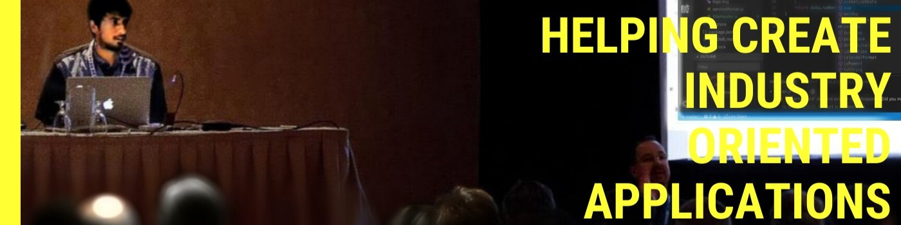

<h1 align="center">Hi 👋, I'm Nikhilesh Pandey</h1>

&nbsp;

<h3 align="center">Experienced senior/lead developer with a strong focus on quality code and robust system architecture. I work primarily with web technologies.</h3>

  

- 🔭 I’m currently working on multiple Full Stack Projects and a **POS Generator** MEAN App

- 🌱 I’m currently learning **GraphQL, MongoDB, Design Patterns (Javascript)**

- 👯 I’m looking to collaborate on **Open Source Projects**

- 👨‍💻 My Profile Card [https://b0n-echo.github.io/](https://b0n-echo.github.io/)

- 📝 I regulary write articles on [https://medium.com/@nikhilesh.pandey](https://medium.com/@nikhilesh.pandey)

- 💬 Ask me about **Javascript, Angular, Typescript, Nodejs, GarphQL, MongoDB**

- 📫 How to reach me **nikhileshhpandey@gmail.com**

## 👨🏻‍💻 My Languages/Tools:

&nbsp;&nbsp;&nbsp;&nbsp;&nbsp;&nbsp;&nbsp;&nbsp;&nbsp;&nbsp;&nbsp;&nbsp;&nbsp;&nbsp;&nbsp;&nbsp;&nbsp;&nbsp;

 

 
 

 

## 📈 My Stats:

## ☎️ Contact Me:

<!--  -->
<!--  -->

  
